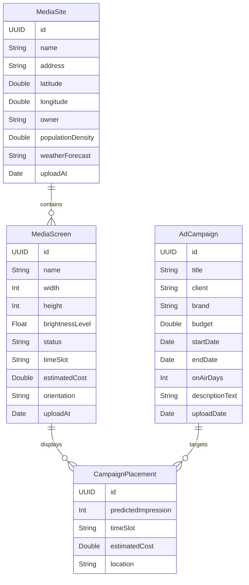

# 📘 CORA ERD (Entity Relationship Diagram) v1.0

## 🧱 Entity Overview

---

## 🔄 관계 설명

- **MediaSite → MediaScreen**: 한 사이트에는 여러 개의 스크린이 설치될 수 있음
- **MediaScreen → CampaignPlacement**: 스크린 하나가 여러 캠페인을 가질 수 있음 (시간대별로)
- **AdCampaign → CampaignPlacement**: 하나의 캠페인이 여러 스크린에 배치될 수 있음

---

## 🗂️ 추천 구조 대응 (비정규)
- `Recommendation`은 ERD에 직접 포함되지 않음
- `AdCampaign`, `MediaScreen`, `CampaignPlacement`에서 유추된 추천 결과가 API로 전달됨

---

이 구조는 Swift CoreData + Haskell Servant 구조에 대응됩니다. 버전은 `v1.0`입니다.
필요하다면 `v1.1`로 분리하여 추천 결과를 명시할 수 있습니다.

